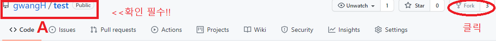
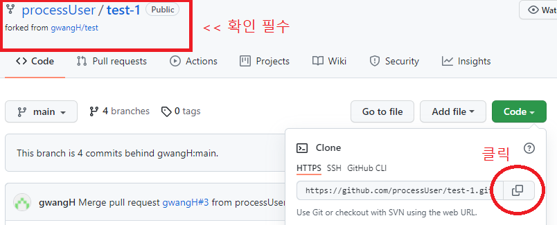
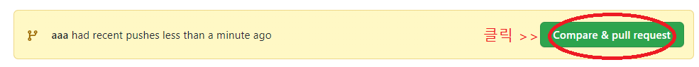
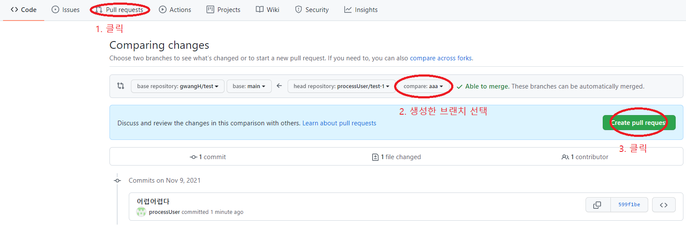
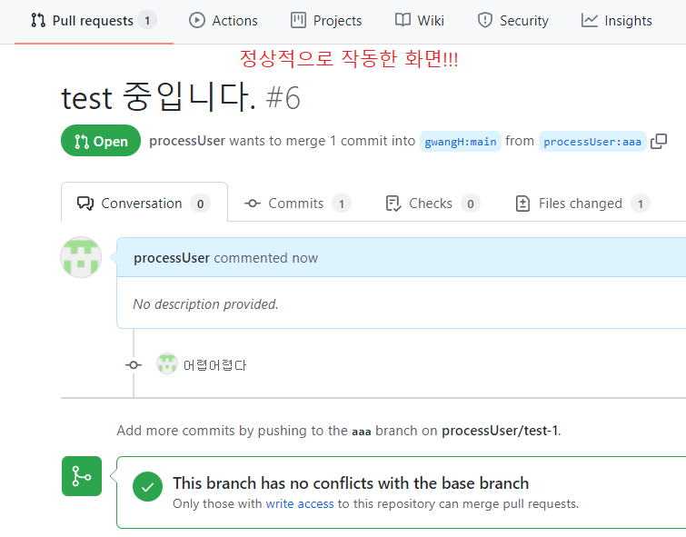
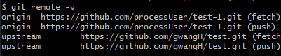
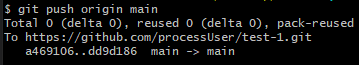

# Git Fork 사용방법
---
1. 처음 이용시 순서<br> 
[1번](#1-Fork ) => [2번](#2-저장소-복사하기) => [3번](#3-브랜치-생성) => [4번](#4-add-/-commit-/-push) => [5번](#5-pull-request<br>) => merge 완료 => [6번](#6-브랜치-이동-/-삭제) => [7번](#7-원격저장소-추가) => [8번](#8-fetch-/-merge-/-push)
2. 두번째 부터 이용순서 <br> 
[8번](#8-fetch-/-merge-/-push) => [3번](#3-브랜치-생성) => [4번](#4-add-/-commit-/-push) => [5번](#5-pull-request<br>) => merge 완료 => [6번](#6-브랜치-이동-/-삭제)
---
## 1. Fork 

- Fork 할 저장소의 위치가 맞는 가 확인 하기!!
- 저장소의 위치가 맞다면 Fork 하기
- `개별 Repositories` 확인 -> Fork한 저장소가 자동 생성 되어있음.

## 2. 저장소 복사하기
```
git clone [원격저장소 주소]
```

- `개별 Repositories`에서 Fork한 저장소 주소를 복사
- `Git Bash` 창에서 `git clone [저장소 주소]` 를 입력한다.

---
## <mark> 원격 저장소를 로컬 저장소로 복사 이후<br> GitHub 사용자 이름 or 자신의 이름 으로 폴더 만들고<br> 해당 폴더 안에서 작업 할 것!!!!!</mark>

---

## 3. 브랜치 생성
```
git checkout -b [브랜치 명]
```
- 브랜치란, main(master)브랜치를 그대로 유지하면서 기존 파일 내용을 수정 or 새로운 기능을 구현할 파일을 만들 수 있다. <br> 브랜치는 나무 가지 라고 생각하세요~
- 브랜치 명은 자유롭게 생성하시면 됩니다.
## 4. add / commit / push
```
git add .
git commit -m "[커밋 할 내용]"
git push origin [생성한 브랜치 명]
```
- 여기서 `commit`한 내용이 `pull request`이후 `commit`내용으로 적용 됩니다.
- origin 은 별칭(변수명) 같은것 입니다. <br>2번 원격 저장소 주소가 자동으로 설정 되어있을 것 입니다.
---
### **_여기까지 하면 개인 원격저장소에 push 되어있다._**
---
## 5. pull request<br>

<!-- TODO 사진추가 -->
- pull request 보내기 방법 1

- pull request 보내기 방법 2 (merge 거절 되었을 때 다시 시도 방법)

- 방법 1 or 방법 2 이후 진행 순서


- 위 이미지랑 동일 하면 성공!!
- <mark>merge 기다리기!!!!</mark>
---
## <mark>merge 완료되면 아래 진행 하기!!!</mark>
---
## 6. 브랜치 이동 / 삭제
```
$ git branch
$ git checkout [브랜치 명]
$ git branch -D [브랜치 명]
```
- `git branch` 를 통해 브랜치 확인 하기
- `git checkout`을 통해 main or marster(브랜치 명)로 이동
- [3번 작업](#3-브랜치-생성) 에서 했던 브랜치 삭제
## 7. 원격저장소 추가
```
$ git remote -v
$ git remote add [해당 저장소 별칭] [원격저장소]
```
- 별칭(변수 같은 것.)은 자유롭게 입력 하면됨.
- [1번 작업](#1-Fork ) 원격저장소 주소<br>
- `git remote -v` 시 나오는 모습<br>


## 8. fetch / merge / push
```
$ git fetch [저장소 별칭]
$ git merge [저장소 별칭]/[브랜치 명]
$ git push origin [원격저장소 브랜치명]
```
- fetch(확인) <br>
    - [7번 작업](#7-원격저장소-추가)에서 입력한 별칭<br>
- fetch 예시<br>

- merge(병합)<br>
    - [7번 작업](#7-원격저장소-추가)에서 입력한 별칭<br>
    - [1번](#1-Fork) 원격저장소 주소 브랜치명<br>

- merge 예시<br>

- push<br>
    - [6번](#6-브랜치-이동-/-삭제)에서 이동한 브랜치명<br>
- push 예시<br>


---
## **_여기까지 하면 pull request 한 내용이 나의 원격저장소에도 적용되었다._**
***