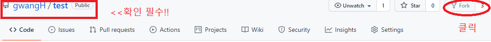

# codingStudy
Koreait학원 국기과정 수강생 코딩스터디

## 규칙

## GitHub 사용방법
<!-- TODO 간략하게 바꾸고 상세한 내용은 링크로 연결하기. -->
1. Fork 

- Fork 할 저장소의 위치가 맞는 가 확인 하기!!
- 저장소의 위치가 맞다면 Fork 하기
- `개별 Repositories` 확인 -> Fork한 저장소가 자동 생성 되어있음.
2. 원격 저장소를 로컬 저장소로 복사하기 (clone 이용)
```
git clone [개별 원격저장소 주소]
```

- `개별 Repositories`에서 Fork한 저장소 주소를 clone하기!!
3. 브랜치 생성
```
git checkout -b [브랜치 명]
```
4. add / commit / push
```
git add .
git commit -m "[커밋 할 내용]"
git push origin [생성한 브랜치 명]
```
- **_여기까지 하면 개인 원격저장소에 push 되어있다._**
5. pull request 보내기<br>
merge 완료되면 6번 진행 하기!!!
<!-- TODO 사진추가 -->

6. 브랜치 이동 / 삭제
```
$ git checkout [이동할 브랜치 명]
$ git branch -D [삭제할 브랜치 명]
```
<!-- TODO 상세설명 추가 -->

7. 통합 원격저장소 추가
```
git remote add [해당 저장소 별칭] [통합 원격저장소]
```
<!-- TODO 상세설명 추가 -->

8. fetch(확인) / merge(병합) / push <br>
**_두번째 작업부터 1순위 진행 작업_**
```
$ git fetch [7번 저장소 별칭]
$ git merge [7번 저장소 별칭]/[브랜치 명]
$ git push origin [나의 원격저장소 브랜치명]
```
<!-- TODO 상세설명 추가 -->

- **_여기까지 하면 pull request 한 내용이 나의 원격저장소에도 적용되었다._**


## 스터디 일정
일시|범위
:---:|:---:
11.11(목)|[입출력과 사칙연산](https://www.acmicpc.net/step/1)
11.18(목)|[if문](https://www.acmicpc.net/step/4) / [for문](https://www.acmicpc.net/step/3)
11.25(목)|[while문](https://www.acmicpc.net/step/2) / [1차원 배열](https://www.acmicpc.net/step/6)
12.02(목)|[함수](https://www.acmicpc.net/step/5) / [문자열](https://www.acmicpc.net/step/7)
12.09(목)|
12.16(목)|
12.23(목)|
12.30(목)|

## Reference
https://chanhuiseok.github.io/posts/git-3/<br>
https://chanhuiseok.github.io/posts/git-2/<br>
https://github.com/next-step/nextstep-docs/blob/master/codereview/review-step1.md<br>
https://github.com/techinpark/github-template-tutorial<br>
